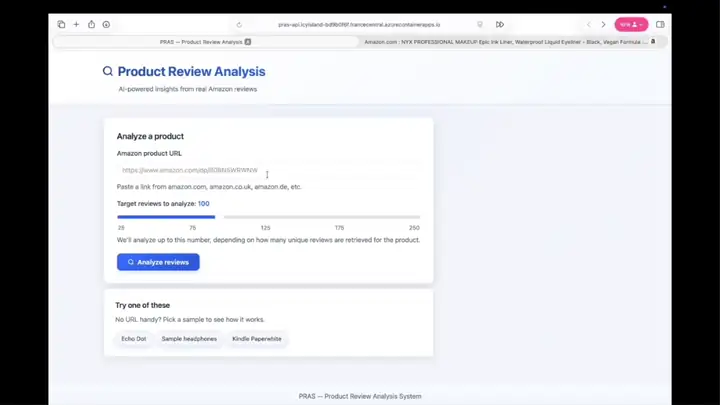
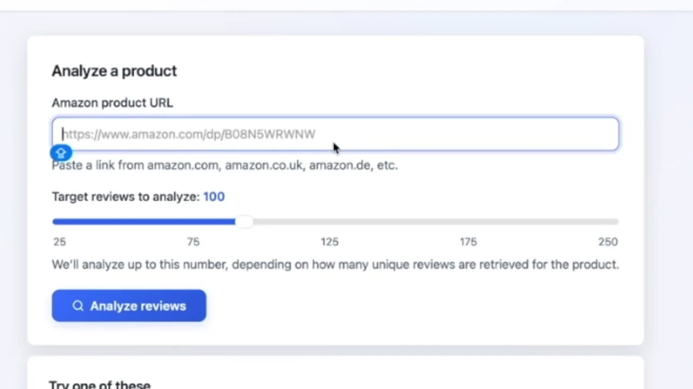
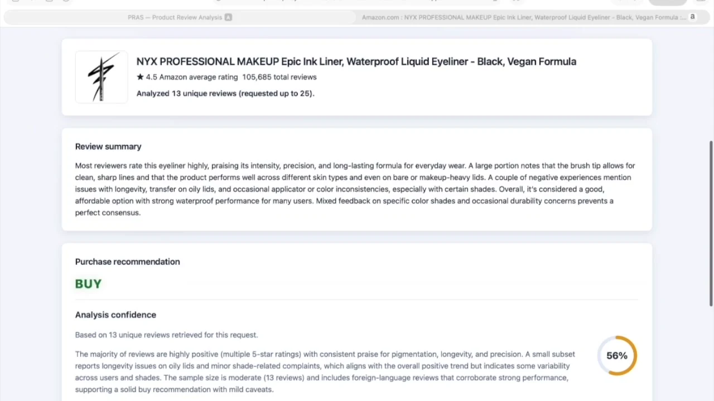
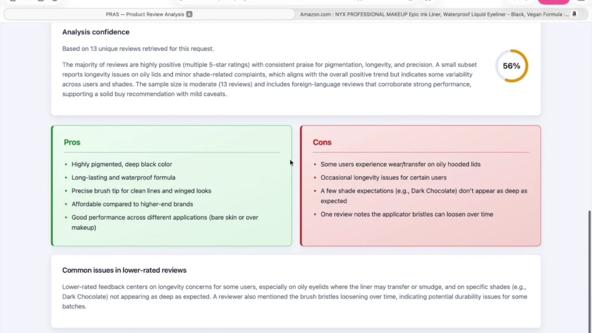
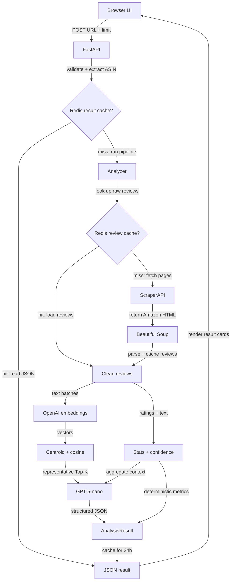

<div align="center">

# PRAS

### Product Review Analysis System

**From an Amazon product link to evidence-grounded buying insights.**

PRAS retrieves customer reviews, removes noisy and duplicate data, selects representative evidence with semantic embeddings, and produces a structured purchase analysis through a FastAPI application.

<p>
  
  
  
  
  
  
</p>

**Explore PRAS:** [See It in Action](#demo) · [How It Works](#architecture) · [Engineering Decisions](#engineering-highlights) · [Inside the Pipeline](#technical-design) · [Tech Stack](#technology-stack) · [Try It Yourself](#run-locally)

</div>

## Demo

<p align="center">
  
</p>

<p align="center"><sub>Recorded from the working PRAS interface: URL submission → analysis → summary, recommendation, confidence, pros, and cons.</sub></p>

<details>
<summary><strong>View static screenshots</strong></summary>
<br>
<p align="center">
  
  
</p>
<p align="center">
  
</p>
</details>

## At a Glance

| Input | Processing | Output |
|---|---|---|
| Amazon product URL and requested review limit (25–250) | Scraping → cleaning → statistics → embeddings → semantic selection → LLM analysis | Review consensus, recommendation, pros, cons, recurring complaints, and a confidence score for the available evidence |

## Engineering Highlights

- **Representative evidence.** `text-embedding-3-small` turns review text into vectors; NumPy computes their centroid, and scikit-learn ranks reviews by cosine similarity before LLM analysis.
- **Computed confidence.** A deterministic score combines review volume, rating spread, and text length; it is not a value generated by the LLM.
- **Two Redis cache layers.** Raw reviews and completed analyses are cached separately for 24 hours, keyed by ASIN and requested review count.
- **Review quality controls.** ScraperAPI and Beautiful Soup collect and parse Amazon pages; preprocessing validates ratings, filters unusable or promotional text, and deduplicates reviews.
- **Failure-aware behavior.** Cache errors fall back to fresh computation, invalid cache entries are ignored, and unavailable LLM analysis falls back to a statistics-based result.
- **End-to-end delivery.** FastAPI serves a responsive browser UI and JSON API; the repository includes automated tests, a non-root Docker image, health checks, and Azure deployment scripts.

## Architecture



The result cache and raw-review cache use separate Redis key spaces. On real-data runs, product metadata is retrieved separately so the response can include the title, image, price, Amazon rating, and total review count.

## Technical Design

### 1. Review acquisition

The API validates the URL, extracts the ASIN, and checks the completed-analysis cache. On a miss, the scraper checks the raw-review cache before requesting paginated Amazon pages through ScraperAPI.

The parser collects:

- Review text and rating
- Review date
- Helpful-vote count
- Verified-purchase status
- Product title, image, price, rating, and total review count when available

### 2. Cleaning and statistics

The processing layer removes unusable text, clamps ratings into the valid range, filters explicit promotional spam, and deduplicates normalized review bodies. It then calculates the average rating, 1–5 star distribution, negative-review count, and number of analyzed reviews.

### 3. Semantic review selection

1. Review texts are embedded with `text-embedding-3-small` in batches of up to 150.
2. The mean embedding forms a centroid representing the collection.
3. Cosine similarity ranks every review by its distance from that centroid.
4. The selected context scales with the cleaned dataset: `k = max(20, floor(0.70 × n))`, capped by the number of available reviews.

This limits the context sent to the LLM and favors reviews close to the collection's central theme; it does not guarantee coverage of minority opinions.

### 4. Structured LLM analysis

The representative reviews and aggregate statistics are sent through the OpenAI Responses API. `GPT-5-nano` is the default model, with configuration support for a compatible GPT-5 model.

The analyzer returns normalized JSON containing:

- Review summary
- Pros and cons
- Aspect-level sentiment
- Buy / don't-buy recommendation
- Confidence explanation
- Summary of complaints in 1–3 star reviews

### 5. Deterministic confidence

The confidence score is normalized to `[0, 1]` and calculated as:

`confidence = 0.50 × review_count_factor + 0.30 × rating_spread_factor + 0.20 × text_quality_factor`

This score measures the strength of the available review evidence, not the probability that a product is objectively good.

## Technology Stack

| Layer | Technology | Role |
|---|---|---|
| Language | **Python 3.11+** | Application and analysis pipeline |
| API | **FastAPI, Pydantic, Uvicorn** | Typed request validation, JSON endpoints, and OpenAPI docs |
| Language model | **GPT-5-nano, OpenAI Responses API** | Structured review synthesis and recommendation |
| Embeddings | **text-embedding-3-small** | Vector representation of review text |
| Semantic ranking | **NumPy, scikit-learn** | Centroid calculation and cosine similarity |
| Retrieval | **ScraperAPI, Requests** | Live Amazon page acquisition |
| Parsing | **Beautiful Soup** | Review and product-metadata extraction |
| Cache | **Redis** | Raw-review and final-analysis caches with 24-hour TTL |
| Frontend | **HTML, CSS, JavaScript** | Responsive, framework-free browser interface |
| Infrastructure | **Docker, Azure Container Apps, Azure Container Registry** | Containerization and cloud deployment |
| Quality | **pytest, pytest-cov, Ruff, pre-commit** | Tests, coverage tooling, linting, and formatting |

## API

### `POST /api/analyze`

<details>
<summary><strong>View request and response example</strong></summary>
<br>

Request:

```json
{
  "amazon_url": "https://www.amazon.com/dp/B08N5WRWNW",
  "max_reviews": 100
}
```

Illustrative response shape (not a live capture):

```json
{
  "product_title": "Example product",
  "amazon_rating": 4.2,
  "total_review_count": 1552,
  "summary_text": "Customers generally praise...",
  "recommendation": "Recommended",
  "confidence_score": 0.82,
  "confidence_explanation": "Confidence is supported by...",
  "pros": ["Strong performance", "Good value"],
  "cons": ["Limited customization"],
  "negative_summary": "Lower-rated reviews most often mention...",
  "total_reviews_analyzed": 21
}
```

</details>

| Method | Endpoint | Purpose |
|---|---|---|
| `GET` | `/` | Browser interface |
| `GET` | `/health` | Docker and Azure liveness check |
| `POST` | `/api/analyze` | Product-review analysis |
| `GET` | `/docs` | Interactive OpenAPI documentation |

## Run Locally

### Prerequisites

- Python 3.11+
- OpenAI API key for embeddings and LLM analysis
- ScraperAPI key for live Amazon review retrieval
- Redis, optional but recommended for caching

### Installation

```bash
git clone https://github.com/LironTal01/Product-Review-Analysis-System.git
cd Product-Review-Analysis-System

python -m venv .venv
source .venv/bin/activate
pip install -e ".[dev]"
```

Copy the versioned environment template, then add your credentials:

```bash
cp .env.example .env
```

`.env` is ignored by Git. Keep `ALLOW_MOCK_FALLBACK=false` when working with live Amazon data.

Run the application:

```bash
uvicorn src.main:app --reload
```

Open [http://localhost:8000](http://localhost:8000) for the application or [http://localhost:8000/docs](http://localhost:8000/docs) for the API explorer.

For a local demonstration without live Amazon retrieval, set `ALLOW_MOCK_FALLBACK=true`. Mock fallback is disabled by default so unavailable live data is not silently presented as scraped data.

### Docker Compose

The local stack starts PRAS, password-protected Redis, and RedisInsight:

```bash
cp .env.example .env
# Add OPENAI_API_KEY and SCRAPER_API_KEY to .env
docker compose up --build
```

The app and API explorer use the same URLs as above; RedisInsight is available at [http://localhost:5540](http://localhost:5540).

To run only the application container:

```bash
docker build -t pras .
docker run --rm -p 8000:8000 --env-file .env pras
```

## Deploy to Azure

The deployment script builds the image in Azure Container Registry and creates or updates an Azure Container App. API credentials and an optional managed Redis URL are stored as Container App secrets rather than plain environment values.

```bash
export ACR_NAME=yourgloballyuniqueacrname
export OPENAI_API_KEY=your_openai_api_key
export SCRAPER_API_KEY=your_scraperapi_key
# Optional: export REDIS_URL=your_managed_redis_url

./scripts/azure_deploy.sh
```

`ACR_NAME` is explicit so repeated deployments update the same registry instead of creating randomly named resources. The script validates required configuration and prints the deployed application and health-check URLs.

## Testing and Quality

The current suite defines 64 test functions across seven modules, covering URL parsing, review cleaning, statistics, confidence scoring, Redis behavior, API validation, cache flow, and the complete analysis pipeline. External network services are mocked in automated tests.

```bash
pytest
pytest --cov=src --cov-report=term-missing
ruff check .
ruff format --check .
```

Test-driven development was used for the URL parser and statistics calculator, with additional tests-first work around review cleaning and confidence scoring.

<details>
<summary><strong>View repository structure</strong></summary>
<br>

```text
src/
├── analysis/       # Embeddings, semantic ranking, LLM analysis, confidence
├── core/           # End-to-end pipeline orchestration
├── data/           # Amazon scraping and optional mock data
├── db/             # Redis cache helpers
├── models/         # Typed domain and response models
├── processing/     # Review cleaning and statistics
├── static/         # Browser interface
├── utils/          # Configuration, logging, and URL parsing
└── main.py         # FastAPI application

tests/              # Unit, integration, API, and cache tests
scripts/            # Azure deployment and teardown
```

</details>

## Transparency and Limitations

- In real-world use across the products analyzed, Amazon's anti-scraping protections limited the reviews ScraperAPI could retrieve to about 21, even when more were requested. In live mode, PRAS analyzes the reviews returned without filling the remainder with mock data.
- Centroid-based selection can underrepresent minority opinions. Rating distribution and the count of low-rated reviews remain visible, but the LLM summary may not capture every viewpoint.
- LLM-generated wording can vary. Statistics and the confidence score are calculated deterministically by the application.
- PRAS is an independent academic project and is not affiliated with or endorsed by Amazon, OpenAI, ScraperAPI, or Microsoft.

## Authors

Developed by Liron Tal and Shani Rahamim as a joint academic project. Original concept by Liron Tal.

