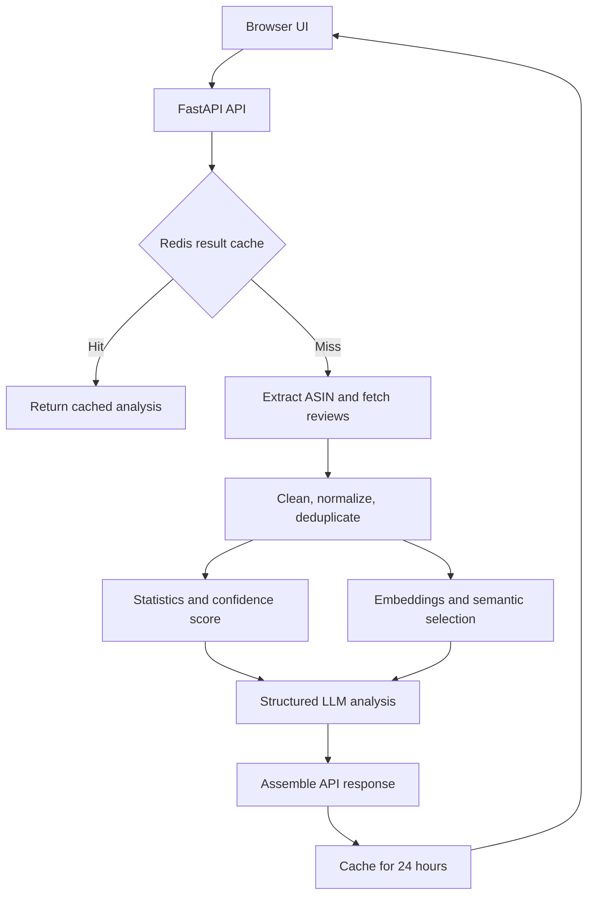

<div align="center">

# PRAS — Product Review Analysis System

**Turn large collections of Amazon reviews into concise, evidence-grounded purchasing insights.**

Python · FastAPI · OpenAI · Embeddings · Redis · Docker · Azure

</div>

## Overview

PRAS accepts an Amazon product URL, retrieves customer reviews, cleans and deduplicates the data, selects a representative subset with semantic embeddings, and uses an LLM to generate a structured product analysis.

The result is presented through a responsive browser interface and a FastAPI JSON API, including:

- A concise review summary
- A buy / don't-buy recommendation
- The most common pros and cons
- A summary of low-rated feedback
- Review statistics and analysis coverage
- A deterministic confidence score

The system is designed as an end-to-end engineering project rather than a single LLM call: it combines data acquisition, preprocessing, semantic retrieval, structured generation, caching, testing, containerization, and cloud deployment.

## Why It Is Technically Interesting

### Representative review selection

Sending every review to an LLM is expensive and often redundant. PRAS embeds the cleaned review texts with OpenAI's `text-embedding-3-small`, computes the centroid of the resulting vectors, and ranks reviews by cosine similarity to that centroid. The most representative reviews are then passed to the analysis stage.

### Deterministic confidence scoring

The displayed confidence value is calculated by the application, not invented by the LLM. It combines three measurable signals:

- Review count — 50%
- Rating diversity — 30%
- Average text depth — 20%

### Graceful degradation

External services are treated as optional runtime dependencies where possible:

- Redis failures fall back to fresh computation.
- Invalid or empty cache entries are ignored.
- LLM failures fall back to a deterministic statistics-based result.
- Mock review data can be explicitly enabled for local development and demonstrations.

## Architecture



## Processing Pipeline

1. Validate the Amazon URL and extract its ASIN.
2. Check Redis for an existing analysis keyed by ASIN and requested review count.
3. Retrieve review pages through ScraperAPI and parse them with Beautiful Soup.
4. Remove empty or promotional content, normalize ratings, and deduplicate canonicalized review text.
5. Calculate rating statistics and a deterministic confidence score.
6. Generate embeddings in batches and select representative reviews with cosine similarity.
7. Send the selected reviews and aggregate statistics to the OpenAI Responses API.
8. Validate and normalize the structured JSON output.
9. Return the result through FastAPI and cache both raw reviews and final analyses for 24 hours.

## Features

- Amazon URL validation and ASIN extraction across common Amazon domains
- Configurable analysis of 25–250 reviews per request
- Review scraping with pagination, route fallbacks, metadata extraction, and caching
- Cleaning pipeline for empty text, invalid ratings, promotional spam, and duplicates
- OpenAI embeddings with centroid-based representative review selection
- Structured LLM output with retries and safe defaults
- Responsive HTML, CSS, and JavaScript interface
- Recent-product history stored locally in the browser
- FastAPI endpoints for the UI, health checks, and product analysis
- Two-tier Redis caching for raw review payloads and final results
- Docker image with a non-root runtime user and health check
- Azure Container Apps deployment and teardown scripts
- Unit, integration, API, and cache tests with external services mocked

## API

### `POST /api/analyze`

Request:

```json
{
  "amazon_url": "https://www.amazon.com/dp/B08N5WRWNW",
  "max_reviews": 100
}
```

Example response shape:

```json
{
  "product_title": "Example product",
  "amazon_rating": 4.2,
  "total_review_count": 1552,
  "summary_text": "Customers generally praise...",
  "recommendation": "Recommended",
  "confidence_score": 0.82,
  "confidence_explanation": "Confidence is supported by...",
  "pros": ["Strong performance", "Good value"],
  "cons": ["Limited customization"],
  "negative_summary": "Lower-rated reviews most often mention...",
  "total_reviews_analyzed": 100
}
```

Other endpoints:

| Method | Endpoint | Purpose |
|---|---|---|
| `GET` | `/` | Serve the browser interface |
| `GET` | `/health` | Liveness check |
| `GET` | `/docs` | Interactive OpenAPI documentation |

## Technology Stack

| Area | Technologies |
|---|---|
| Backend | Python 3.11+, FastAPI, Pydantic, Uvicorn |
| AI and retrieval | OpenAI Responses API, OpenAI embeddings, NumPy, scikit-learn |
| Data acquisition | ScraperAPI, Requests, Beautiful Soup |
| Cache | Redis |
| Frontend | HTML, CSS, JavaScript |
| Infrastructure | Docker, Azure Container Apps, Azure Container Registry |
| Quality | pytest, pytest-cov, Ruff, pre-commit |

## Project Structure

```text
src/
├── analysis/       # Embeddings, representative selection, LLM analysis, confidence
├── core/           # End-to-end pipeline orchestration
├── data/           # Amazon scraping and optional mock data
├── db/             # Redis caches for reviews and analysis results
├── models/         # Typed domain and response models
├── processing/     # Review cleaning and aggregate statistics
├── static/         # Responsive browser UI
├── utils/          # Configuration, logging, and URL parsing
└── main.py         # FastAPI application and endpoints

tests/              # Unit, integration, API, and cache tests
scripts/            # Azure deployment and teardown
```

## Running Locally

### Prerequisites

- Python 3.11+
- An OpenAI API key for embeddings and LLM analysis
- A ScraperAPI key for live Amazon review retrieval
- Redis, optional but recommended for caching

### Installation

```bash
git clone https://github.com/LironTal01/Product-Review-Analysis-System.git
cd Product-Review-Analysis-System

python -m venv .venv
source .venv/bin/activate
pip install -r requirements.txt
```

Create a `.env` file in the repository root:

```dotenv
OPENAI_API_KEY=your_openai_api_key
SCRAPER_API_KEY=your_scraperapi_key
OPENAI_LLM_MODEL=gpt-5-nano
REDIS_URL=redis://localhost:6379/0
ALLOW_MOCK_FALLBACK=false
LOG_LEVEL=INFO
```

For an offline-style local demonstration, set `ALLOW_MOCK_FALLBACK=true`. Mock fallback is disabled by default so missing live data is not silently presented as scraped data.

Start the application:

```bash
uvicorn src.main:app --reload
```

Open [http://localhost:8000](http://localhost:8000) for the interface or [http://localhost:8000/docs](http://localhost:8000/docs) for the API documentation.

### Docker

```bash
docker build -t pras .
docker run --rm -p 8000:8000 --env-file .env pras
```

## Tests and Code Quality

```bash
pytest
pytest --cov=src --cov-report=term-missing
ruff check .
ruff format --check .
```

The test suite covers URL parsing, review cleaning, statistics, confidence scoring, Redis behavior, API validation, cache flow, and the complete analysis pipeline. Network-dependent services are mocked in automated tests.

## Design Notes and Limitations

- Live review retrieval depends on Amazon page structure, regional availability, and ScraperAPI responses, so fewer reviews may be available than requested.
- The semantic selection stage identifies reviews closest to the collection centroid; it is intended to reduce redundancy, not to guarantee complete representation of every minority opinion.
- LLM-generated summaries can vary. Rating statistics and the confidence score are computed deterministically by the application.
- The project is an independent academic implementation and is not affiliated with or endorsed by Amazon, OpenAI, ScraperAPI, or Microsoft.

## Authors

Developed as a two-person academic project by **Liron Tal** and **Shani Rahamim**.

- **Liron Tal** — originated the product concept and led the architecture and primary end-to-end implementation.
- **Shani Rahamim** — contributed to infrastructure, deployment, testing, and interface refinement.
